# 🛡️ Sentinel-E — Multi-Model Cognitive Reasoning Engine

> **Structural Epistemic Intelligence Layer for Multi-Model AI Systems**
>
> Sentinel-E orchestrates 9 language models across 4 providers into a unified reasoning system with adversarial debate, evidence verification, transparent diagnostics, and collaborative synthesis — all accessible through a single chat interface.

---

## What This System Does

Sentinel-E is not a chatbot wrapper. It is a **meta-cognitive orchestration layer** that sits between the user and multiple AI models. When a user submits a query, Sentinel-E does not simply forward it to one model and return the response. Instead, it:

1. **Routes the query** through a complexity classifier (trivial, moderate, complex, expert)
2. **Distributes the work** across specialized models based on the operating mode
3. **Compares, critiques, and synthesizes** the outputs using structured scoring
4. **Reports confidence** based on inter-model agreement, not self-reported certainty

The core insight: **agreement between models does not equal truth**. Sentinel-E stress-tests consensus to determine whether agreement is structurally stable or superficially coincidental.

---

## System Architecture

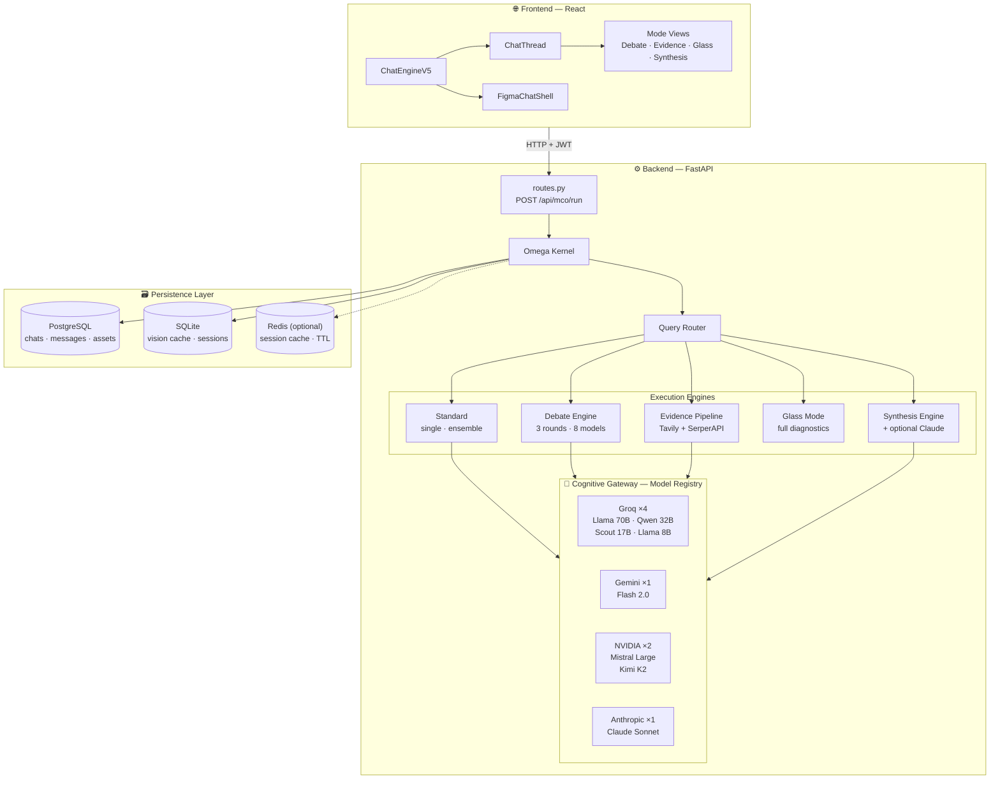
```mermaid
flowchart TB
    subgraph Frontend["🌐 Frontend — React"]
        UI[ChatEngineV5]
        CT[ChatThread]
        MV["Mode Views<br/>Debate · Evidence · Glass · Synthesis"]
        FS[FigmaChatShell]
        UI --> CT --> MV
        UI --> FS
    end

    subgraph Backend["⚙️ Backend — FastAPI"]
        API["routes.py<br/>POST /api/mco/run"]
        OK[Omega Kernel]
        QR[Query Router]

        API --> OK --> QR

        subgraph Engines["Execution Engines"]
            STD["Standard<br/>single · ensemble"]
            DE["Debate Engine<br/>3 rounds · 8 models"]
            EP["Evidence Pipeline<br/>Tavily + SerperAPI"]
            GL["Glass Mode<br/>full diagnostics"]
            SY["Synthesis Engine<br/>+ optional Claude"]
        end

        QR --> STD
        QR --> DE
        QR --> EP
        QR --> GL
        QR --> SY

        subgraph Gateway["🤖 Cognitive Gateway — Model Registry"]
            G1["Groq ×4<br/>Llama 70B · Qwen 32B<br/>Scout 17B · Llama 8B"]
            G2["Gemini ×1<br/>Flash 2.0"]
            G3["NVIDIA ×2<br/>Mistral Large<br/>Kimi K2"]
            G4["Anthropic ×1<br/>Claude Sonnet"]
        end

        STD --> Gateway
        DE --> Gateway
        EP --> Gateway
        SY --> Gateway
    end

    subgraph Storage["🗃️ Persistence Layer"]
        PG[(PostgreSQL<br/>chats · messages · assets)]
        SQ[(SQLite<br/>vision cache · sessions)]
        RD[("Redis (optional)<br/>session cache · TTL")]
    end

    Frontend -->|"HTTP + JWT"| API
    OK --> PG
    OK --> SQ
    OK -.-> RD
```

---

## Request Lifecycle

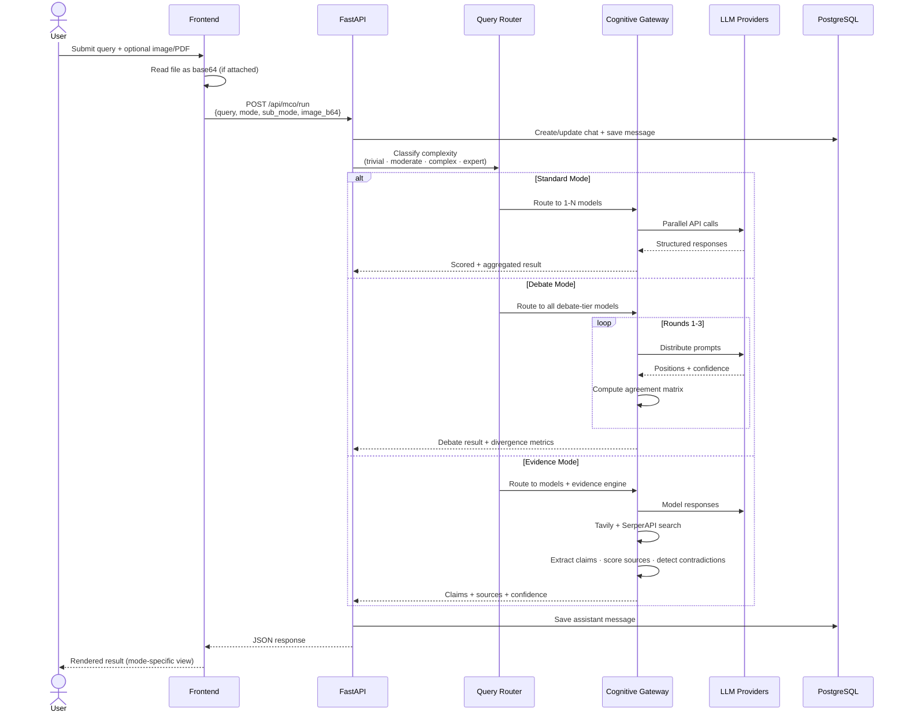
```mermaid
sequenceDiagram
    actor User
    participant FE as Frontend
    participant API as FastAPI
    participant QR as Query Router
    participant GW as Cognitive Gateway
    participant Models as LLM Providers
    participant DB as PostgreSQL

    User->>FE: Submit query + optional image/PDF
    FE->>FE: Read file as base64 (if attached)
    FE->>API: POST /api/mco/run<br/>{query, mode, sub_mode, image_b64}
    API->>DB: Create/update chat + save message
    API->>QR: Classify complexity<br/>(trivial · moderate · complex · expert)

    alt Standard Mode
        QR->>GW: Route to 1-N models
        GW->>Models: Parallel API calls
        Models-->>GW: Structured responses
        GW-->>API: Scored + aggregated result
    else Debate Mode
        QR->>GW: Route to all debate-tier models
        loop Rounds 1-3
            GW->>Models: Distribute prompts
            Models-->>GW: Positions + confidence
            GW->>GW: Compute agreement matrix
        end
        GW-->>API: Debate result + divergence metrics
    else Evidence Mode
        QR->>GW: Route to models + evidence engine
        GW->>Models: Model responses
        GW->>GW: Tavily + SerperAPI search
        GW->>GW: Extract claims · score sources · detect contradictions
        GW-->>API: Claims + sources + confidence
    end

    API->>DB: Save assistant message
    API-->>FE: JSON response
    FE-->>User: Rendered result (mode-specific view)
```

---

## Model Registry (9 Models, 4 Providers)

| Model | Provider | Role | Debate Tier | Notes |
|-------|----------|------|-------------|-------|
| Llama 3.3 70B | Groq | Analysis anchor | Tier 1 | Primary reasoning model |
| Qwen 3 32B | Groq | Cross-analysis | Tier 2 | Registered as `mixtral-8x7b` |
| Llama 4 Scout 17B | Groq | Critique | Tier 2 | Fast critique generation |
| Llama 3.1 8B Instant | Groq | Verification | Tier 3 | Lightweight verification |
| Qwen 2.5 VL 7B | Qwen/DashScope | Vision + critique | Tier 2 | Supports image input |
| Gemini Flash 2.0 | Google | Synthesis + vision | Tier 3 | 1M token context window |
| Mistral Large 3 | NVIDIA | Deep analysis | Tier 1 | Conservative reasoning |
| Kimi K2 Thinking | NVIDIA | Extended critique | Tier 2 | Chain-of-thought model |
| Claude Sonnet | Anthropic | Synthesis only | — | Optional toggle, not used in debate |

**Debate Tier Strategy:**
- **Tier 1 (Analysis):** Llama 70B + Mistral Large — produce primary analysis
- **Tier 2 (Critique):** Qwen 32B, Llama Scout, Qwen VL, Kimi K2 — generate counter-arguments
- **Tier 3 (Synthesis):** Gemini Flash, Llama 8B — synthesize and verify

**Round-1-Only Models:** Qwen VL, Gemini Flash, and Kimi K2 participate in Round 1 only and are excluded from Rounds 2-3 to avoid failures from rate limits, empty responses, and quota exhaustion. Their Round 1 analysis is preserved in the debate context — they are shown as "Round 1 Analysis Only" contributors, not failures.

**Claude Budget Protection:** Claude starts **disabled by default** and must be toggled on by the user. It is capped at 500 output tokens and ~500 input tokens per call. A usage tracker monitors cumulative cost against a configurable budget (default $5).

---

## Operating Modes

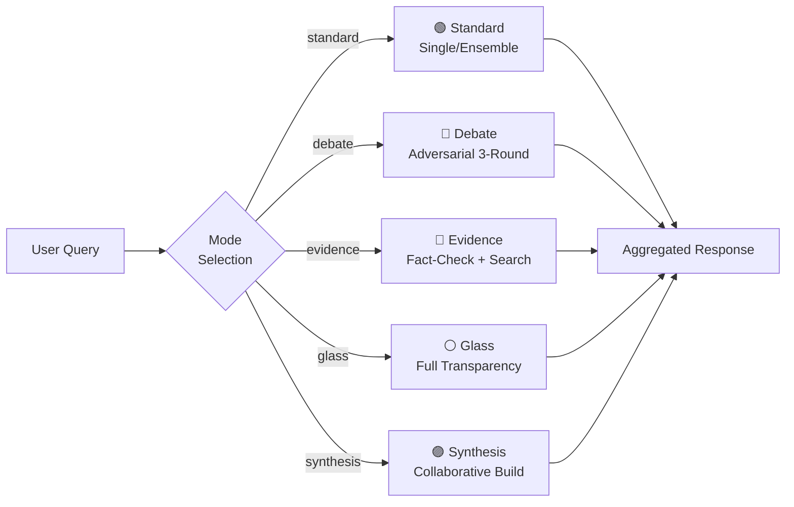
```mermaid
flowchart LR
    Q[User Query] --> MC{Mode<br/>Selection}

    MC -->|standard| STD["🟢 Standard<br/>Single/Ensemble"]
    MC -->|debate| DEB["🔴 Debate<br/>Adversarial 3-Round"]
    MC -->|evidence| EVI["🔵 Evidence<br/>Fact-Check + Search"]
    MC -->|glass| GLA["⚪ Glass<br/>Full Transparency"]
    MC -->|synthesis| SYN["🟣 Synthesis<br/>Collaborative Build"]

    STD --> OUT[Aggregated Response]
    DEB --> OUT
    EVI --> OUT
    GLA --> OUT
    SYN --> OUT
```

### Standard Mode
Single query → parallel model execution → scored aggregation → best response.

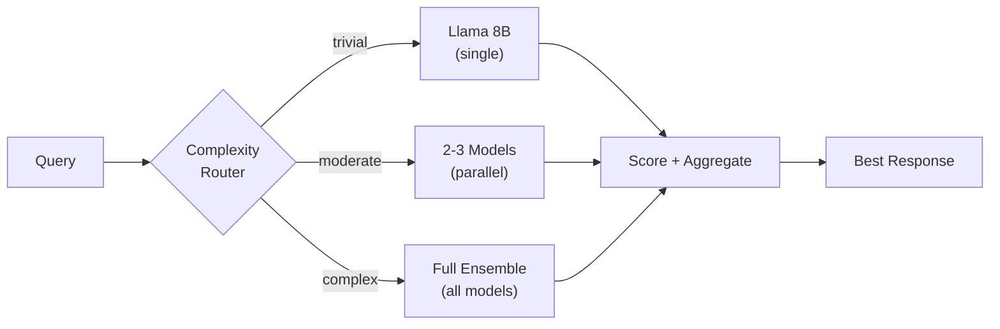
```mermaid
flowchart LR
    Q[Query] --> CR{Complexity<br/>Router}
    CR -->|trivial| S1["Llama 8B<br/>(single)"]
    CR -->|moderate| S2["2-3 Models<br/>(parallel)"]
    CR -->|complex| S3["Full Ensemble<br/>(all models)"]
    S1 --> AGG[Score + Aggregate]
    S2 --> AGG
    S3 --> AGG
    AGG --> R[Best Response]
```

The query router classifies complexity and routes accordingly:
- **Trivial:** Single fast model (Llama 8B)
- **Moderate:** 2-3 models in parallel
- **Complex/Expert:** Full ensemble (all enabled models)

When an image or PDF is attached, the system uses a **vision-first strategy**: the vision model (Qwen VL or Gemini Flash) processes the image first, extracts a structured description, and distributes that text summary to non-vision models. This avoids sending raw images to every model.

### Debate Mode
Multi-round adversarial argumentation across up to 8 models.

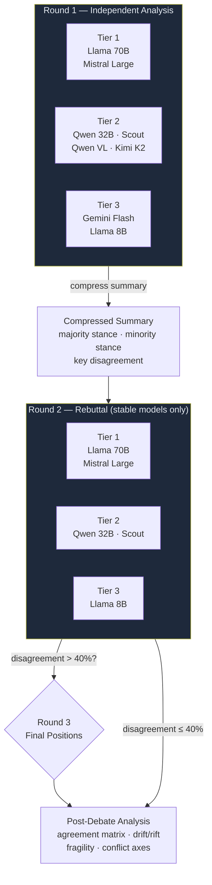
```mermaid
flowchart TB
    subgraph R1["Round 1 — Independent Analysis"]
        direction LR
        T1A["Tier 1<br/>Llama 70B<br/>Mistral Large"]
        T2A["Tier 2<br/>Qwen 32B · Scout<br/>Qwen VL · Kimi K2"]
        T3A["Tier 3<br/>Gemini Flash<br/>Llama 8B"]
    end

    R1 -->|compress summary| SUM["Compressed Summary<br/>majority stance · minority stance<br/>key disagreement"]

    subgraph R2["Round 2 — Rebuttal (stable models only)"]
        direction LR
        T1B["Tier 1<br/>Llama 70B<br/>Mistral Large"]
        T2B["Tier 2<br/>Qwen 32B · Scout"]
        T3B["Tier 3<br/>Llama 8B"]
    end

    SUM --> R2

    R2 -->|disagreement > 40%?| R3{"Round 3<br/>Final Positions"}
    R2 -->|disagreement ≤ 40%| POST

    R3 --> POST["Post-Debate Analysis<br/>agreement matrix · drift/rift<br/>fragility · conflict axes"]

    style R1 fill:#1e293b,color:#e2e8f0
    style R2 fill:#1e293b,color:#e2e8f0
```

> **Round-1-only models** (Qwen VL, Gemini Flash, Kimi K2) contribute their analysis in Round 1 and their output is preserved in context, but they do not execute in Rounds 2-3.

**Visualization:** The frontend renders a divergence dashboard with:
- Drift/Rift/Fragility gauge cards
- Per-round rift vs disagreement area chart
- Per-model drift trajectory line chart
- Radar chart showing per-axis model positions
- Confidence evolution line chart across rounds
- Pairwise agreement heatmap

### Evidence Mode
Fact-checking pipeline with real-time web search.

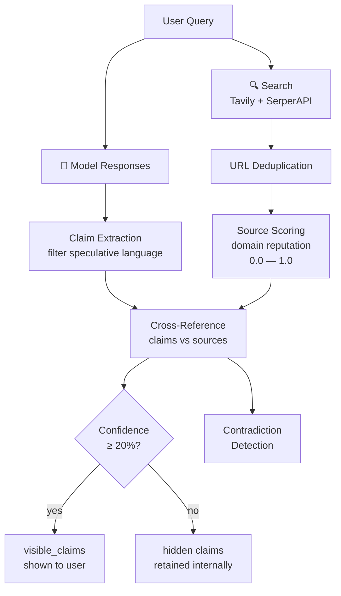
```mermaid
flowchart TB
    Q[User Query] --> SEARCH["🔍 Search<br/>Tavily + SerperAPI"]
    Q --> MODELS["🤖 Model Responses"]

    SEARCH --> DEDUP["URL Deduplication"]
    DEDUP --> SCORE["Source Scoring<br/>domain reputation<br/>0.0 — 1.0"]

    MODELS --> EXTRACT["Claim Extraction<br/>filter speculative language"]

    EXTRACT --> CROSS["Cross-Reference<br/>claims vs sources"]
    SCORE --> CROSS

    CROSS --> CONF{"Confidence<br/>≥ 20%?"}
    CONF -->|yes| VIS["visible_claims<br/>shown to user"]
    CONF -->|no| HIDE["hidden claims<br/>retained internally"]

    CROSS --> CONTRA["Contradiction<br/>Detection"]
```

1. **Search:** Queries Tavily API (primary) and SerperAPI (supplementary/fallback) for real-time web results. URLs are deduplicated across both providers.
2. **Source Scoring:** Each source gets a reliability score based on domain reputation (e.g., nature.com → 0.90, wikipedia.org → 0.70, reddit.com → 0.35).
3. **Claim Extraction:** Model outputs are parsed into individual claims. Only factual, verifiable statements are treated as claims — speculative language ("might indicate", "could suggest") is filtered out.
4. **Confidence Filtering:** Claims below 20% confidence are hidden from the user but retained internally. The frontend shows only `visible_claims`.
5. **Contradiction Detection:** Cross-source keyword comparison identifies conflicting information.

### Glass Mode
Full transparency/diagnostic mode. Shows the complete internal state: model reasoning steps, scoring breakdown, routing decisions, and token usage. Designed for auditing and debugging the system itself.

### Synthesis Mode
Collaborative reasoning where models build on each other rather than argue.

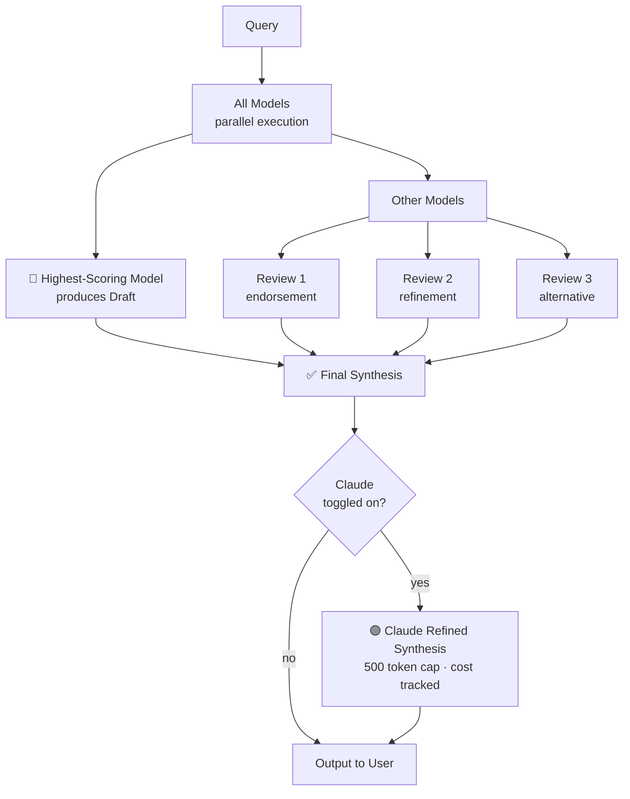
```mermaid
flowchart TB
    Q[Query] --> ALL["All Models<br/>parallel execution"]

    ALL --> BEST["📝 Highest-Scoring Model<br/>produces Draft"]
    ALL --> REST["Other Models"]

    REST --> R1["Review 1<br/>endorsement"]
    REST --> R2["Review 2<br/>refinement"]
    REST --> R3["Review 3<br/>alternative"]

    BEST --> FINAL["✅ Final Synthesis"]
    R1 --> FINAL
    R2 --> FINAL
    R3 --> FINAL

    FINAL --> CLAUDE{"Claude<br/>toggled on?"}
    CLAUDE -->|yes| REF["🟣 Claude Refined Synthesis<br/>500 token cap · cost tracked"]
    CLAUDE -->|no| OUT[Output to User]
    REF --> OUT
```

1. **Draft:** Highest-scoring model produces the initial answer
2. **Peer Review:** Each other model critiques the draft (endorsement, refinement, or alternative)
3. **Consensus Score:** Average agreement across all reviewers
4. **Synthesis Graph:** Visual DAG showing draft → reviews → final synthesis

**Optional Claude Enhancement:** When toggled on, Claude Sonnet receives all model perspectives (truncated to 800 chars each, max 6 models) and produces a refined synthesis. The Claude call is capped at 500 output tokens. Usage cost is tracked and displayed in the frontend.

---

## Multimodal Pipeline

Sentinel-E supports image and PDF input across all modes.

### How Images and PDFs Flow Through the System

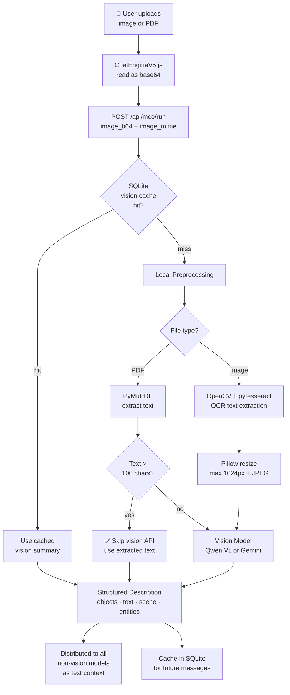
```mermaid
flowchart TB
    UP["📎 User uploads<br/>image or PDF"] --> FE["ChatEngineV5.js<br/>read as base64"]

    FE --> API["POST /api/mco/run<br/>image_b64 + image_mime"]

    API --> CACHE{"SQLite<br/>vision cache<br/>hit?"}
    CACHE -->|hit| REUSE["Use cached<br/>vision summary"]
    CACHE -->|miss| PRE["Local Preprocessing"]

    PRE --> TYPE{"File type?"}

    TYPE -->|PDF| PYMUPDF["PyMuPDF<br/>extract text"]
    PYMUPDF --> ENOUGH{"Text ><br/>100 chars?"}
    ENOUGH -->|yes| SKIP["✅ Skip vision API<br/>use extracted text"]
    ENOUGH -->|no| VISION

    TYPE -->|Image| OCR["OpenCV + pytesseract<br/>OCR text extraction"]
    OCR --> COMPRESS["Pillow resize<br/>max 1024px + JPEG"]
    COMPRESS --> VISION["Vision Model<br/>Qwen VL or Gemini"]

    VISION --> SUMMARY["Structured Description<br/>objects · text · scene · entities"]
    SKIP --> SUMMARY
    REUSE --> SUMMARY

    SUMMARY --> DIST["Distributed to all<br/>non-vision models<br/>as text context"]

    SUMMARY --> SQLCACHE["Cache in SQLite<br/>for future messages"]
```

### Local Preprocessing (file_preprocessor.py)

Before sending anything to a vision API, the system preprocesses locally to minimize token usage:

- **PDF:** PyMuPDF extracts text directly. If the extracted text exceeds 100 characters, the vision API is skipped entirely — saving 100% of vision tokens for text-heavy PDFs.
- **Images:** OpenCV + pytesseract perform OCR to extract any visible text. Pillow compresses and resizes the image (max 1024px) before sending to the vision API.
- **Metadata:** PDF page count, title, and author are extracted and included in the context.

---

## Database Architecture

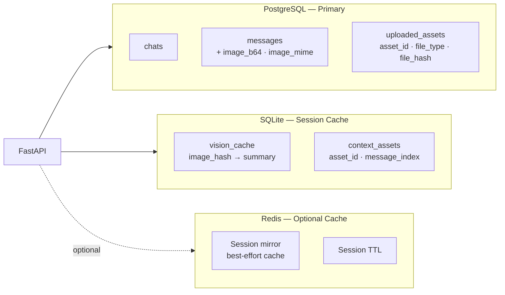
```mermaid
flowchart LR
    subgraph PG["PostgreSQL — Primary"]
        CHATS[chats]
        MSGS[messages<br/>+ image_b64 · image_mime]
        ASSETS[uploaded_assets<br/>asset_id · file_type · file_hash]
    end

    subgraph SQ["SQLite — Session Cache"]
        VC[vision_cache<br/>image_hash → summary]
        CA[context_assets<br/>asset_id · message_index]
    end

    subgraph RD["Redis — Optional Cache"]
        MEM["Session mirror<br/>best-effort cache"]
        TTL["Session TTL"]
    end

    API[FastAPI] --> PG
    API --> SQ
    API -.->|"optional"| RD
```

| Database | Purpose | Schema |
|----------|---------|--------|
| PostgreSQL (Neon) | Primary persistence | chats, messages, uploaded_assets |
| SQLite | Session-level cache | vision_cache, context_assets, session_cache |
| Redis (optional) | Best-effort session mirror | Falls back to in-memory LRU if unavailable |

**Message Storage:** Each message stores `image_b64` and `image_mime` columns so uploaded images persist in chat history and are rendered in the UI.

**Asset Storage:** `uploaded_assets` table tracks files with `asset_id`, `session_id`, `file_type`, `file_url`, `file_hash`, and `created_at`. Vision summaries are cached in SQLite so the same image is only processed once.

---

## API Endpoints

### Core Execution
| Method | Endpoint | Description |
|--------|----------|-------------|
| POST | `/api/run` | Main Sentinel execution (Omega Kernel) |
| POST | `/api/mco/run` | MCO orchestrator (frontend primary endpoint) |
| POST | `/api/model/{model_id}` | Query a single specific model |

### Authentication
| Method | Endpoint | Description |
|--------|----------|-------------|
| POST | `/api/auth/session` | Create anonymous session + JWT |
| POST | `/api/auth/refresh` | Refresh expired access token |

### Models
| Method | Endpoint | Description |
|--------|----------|-------------|
| GET | `/api/models` | List all registered models + status |
| GET | `/api/models/status` | Real-time model availability |
| POST | `/api/models/claude/toggle` | Enable/disable Claude synthesis |
| GET | `/api/models/claude/usage` | Claude usage stats + cost estimate |

### Chat History
| Method | Endpoint | Description |
|--------|----------|-------------|
| GET | `/api/chats` | List user chats |
| GET | `/api/chat/{chat_id}/messages` | Get chat messages |
| PUT | `/api/messages/{message_id}` | Edit message content |
| POST | `/api/messages/{message_id}/regenerate` | Regenerate model response |

### Diagnostics
| Method | Endpoint | Description |
|--------|----------|-------------|
| GET | `/health` | Health check (version, Redis status) |
| GET | `/api/optimization/stats` | Observability/performance metrics |
| POST | `/api/cross-analysis` | Cross-model comparison |

---

## Frontend Components

| Component | Purpose |
|-----------|---------|
| `ChatEngineV5.js` | Master chat controller — mode routing, session management, file upload, JWT auth |
| `ChatThread.js` | Message renderer — UserBubble (image display, PDF badge, copy, edit) + AssistantBubble (ReactMarkdown, copy, regenerate) |
| `FigmaChatShell.js` | Shell layout — model picker sidebar with Claude toggle, mode selector |
| `DebateView.js` | Debate visualization — rounds accordion, divergence dashboard, agreement heatmap, confidence evolution |
| `EvidenceView.js` | Evidence display — claims with confidence filtering, source reliability, contradictions |
| `SynthesisView.js` | Synthesis display — draft, peer reviews, consensus metrics, optional Claude panel |
| `GlassView.js` | Glass/diagnostic display — full reasoning transparency |

**Text Formatting:** All model responses render through ReactMarkdown with remark-gfm, supporting paragraphs, bullet lists, headings, code blocks, and tables.

---

## Project Structure

```
sentinel_e/
├── backend/
│   ├── main.py                    # FastAPI app, all endpoints, middleware
│   ├── core/
│   │   ├── cognitive_orchestrator.py  # Vision-first strategy, model selection
│   │   ├── structured_debate_engine.py # 3-round debate execution
│   │   ├── evidence_engine.py         # Tavily + SerperAPI search
│   │   ├── evidence_pipeline.py       # Claim extraction + confidence filtering
│   │   ├── synthesis_engine.py        # Collaborative synthesis logic
│   │   ├── query_router.py            # Complexity classification
│   │   ├── ensemble_schemas.py        # Debate config, token budgets
│   │   ├── file_preprocessor.py       # OCR, PDF extraction, image compression
│   │   └── multimodal_auditor.py      # Model routing for multimodal
│   ├── metacognitive/
│   │   ├── cognitive_gateway.py       # Model registry, all provider implementations
│   │   ├── routes.py                  # MCO endpoint (/api/mco/run)
│   │   ├── orchestrator.py            # MCO orchestrator pipeline
│   │   └── schemas.py                 # Request/response schemas
│   ├── database/
│   │   ├── models.py                  # SQLAlchemy models (Chat, Message, UploadedAsset)
│   │   ├── crud.py                    # Database operations
│   │   ├── connection.py              # PostgreSQL connection + migrations
│   │   └── session_context.py         # SQLite session cache
│   ├── gateway/                       # Auth (JWT), middleware, rate limiting
│   ├── providers/                     # Provider routing helpers
│   ├── optimization/                  # Token optimizer, response cache, cost governor
│   └── requirements.txt
├── frontend/
│   ├── src/
│   │   ├── components/
│   │   │   ├── ChatEngineV5.js
│   │   │   ├── ChatThread.js
│   │   │   └── structured/           # DebateView, EvidenceView, SynthesisView, GlassView
│   │   ├── services/api.js           # Backend API client
│   │   ├── hooks/useModels.js        # Model state management
│   │   └── figma_shell/              # Shell layout + model picker
│   └── package.json
└── data/                              # Session data, SQLite DB
```

---

## Environment Variables

Create `backend/.env` with the following keys:

### Required — API Keys
```
GROQ_API_KEY=                    # Groq (Llama 70B, Qwen 32B, Llama Scout, Llama 8B)
GEMINI_API_KEY=                  # Google Gemini Flash
NVIDIA_API_KEY=                  # NVIDIA (Mistral Large, Kimi K2)
ANTHROPIC_API_KEY=               # Claude Sonnet (synthesis only, optional)
TAVILY_API_KEY=                  # Evidence search (primary)
SERPER_API_KEY=                  # Evidence search (supplementary)
```

### Required — Infrastructure
```
JWT_SECRET_KEY=                  # JWT signing secret
POSTGRES_URL=                    # PostgreSQL connection string
ENVIRONMENT=development          # development or production
```

### Optional — Separate Model Keys
```
LLAMA31_8B_GROQ_API_KEY=         # If Llama 8B uses a different Groq key
QWEN_API_KEY=                    # If Qwen VL uses DashScope instead of Groq
MISTRAL_LARGE_NVIDIA_API_KEY=    # Separate key for Mistral Large
KIMI_K2_NVIDIA_API_KEY=          # Separate key for Kimi K2
```

### Optional — Configuration
```
REDIS_URL=                       # Redis connection string (falls back to in-memory if missing)
ALLOWED_ORIGINS=http://localhost:3000
MAX_INPUT_LENGTH=10000
MAX_ROUNDS=3
```

---

## Setup

### Backend
```bash
cd backend
python -m venv venv
source venv/bin/activate
pip install -r requirements.txt
# For OCR support (optional):
# brew install tesseract    (macOS)
# apt install tesseract-ocr (Linux)
cp .env.example .env  # Fill in your API keys
uvicorn main:app --reload --port 8000
```

### Frontend
```bash
cd frontend
npm install
npm start
# Opens at http://localhost:3000
```

---

## Known Issues and Design Decisions

### Why do some models fail in Debate Round 2?
Three models (Qwen VL, Gemini Flash, Kimi K2) tend to fail in later debate rounds due to:
- **Qwen VL:** OpenRouter returns empty responses under load
- **Gemini Flash:** Google API quota exhaustion (HTTP 402)
- **Kimi K2:** NVIDIA API returns empty responses with structured debate prompts

**Solution:** These models are classified as "Round 1 Only" — they contribute initial analysis in Round 1, and their output is preserved in the debate context for later rounds, but they do not actively execute in Rounds 2-3. The frontend shows them as blue "Round 1 Analysis Only" contributors rather than red error cards.

### Why is Claude disabled by default?
Claude Sonnet is the most expensive model in the registry. It is restricted to synthesis mode only and starts inactive. Users must explicitly toggle it on via the model picker. Each call is capped at 500 output tokens (~$0.001 per call). A usage tracker monitors cumulative cost.

### Why does the system preprocess images locally before calling vision APIs?
To minimize token usage and API cost. A text-heavy PDF can be fully extracted by PyMuPDF locally — no vision API call needed. For images, OCR extracts visible text and the image is compressed before being sent to the vision model.

### Why are there two execution endpoints (/api/run and /api/mco/run)?
Historical evolution. `/api/run` is the original Omega Kernel endpoint. `/api/mco/run` is the newer MCO (Meta-Cognitive Orchestrator) endpoint used by the current frontend. Both support the full mode system. The frontend exclusively uses `/api/mco/run`.

### How does evidence search handle API failures?
Tavily is the primary search provider. If Tavily returns fewer results than requested (or fails entirely), SerperAPI fills the gap. Results are deduplicated by URL across both providers.

---

## Confidence Computation

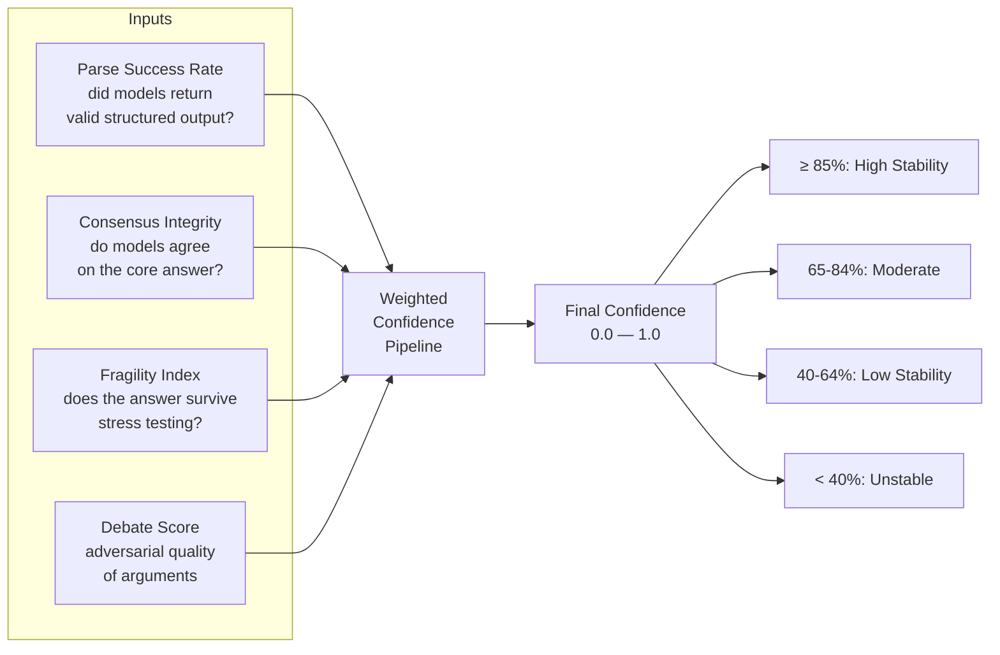
```mermaid
flowchart LR
    subgraph Inputs
        PR["Parse Success Rate<br/>did models return<br/>valid structured output?"]
        CI["Consensus Integrity<br/>do models agree<br/>on the core answer?"]
        FI["Fragility Index<br/>does the answer survive<br/>stress testing?"]
        DS["Debate Score<br/>adversarial quality<br/>of arguments"]
    end

    PR --> WP["Weighted<br/>Confidence<br/>Pipeline"]
    CI --> WP
    FI --> WP
    DS --> WP

    WP --> FC["Final Confidence<br/>0.0 — 1.0"]

    FC --> HIGH["≥ 85%: High Stability"]
    FC --> MOD["65-84%: Moderate"]
    FC --> LOW["40-64%: Low Stability"]
    FC --> UNS["< 40%: Unstable"]
```

---

## Core Principles

- **Agreement ≠ Truth** — Multiple models agreeing does not make them correct. Consensus must be stress-tested.
- **Confidence must be earned** — Confidence scores are computed from inter-model agreement, source reliability, and structural stability, not self-reported by any single model.
- **Inconclusive is a valid answer** — The system will report low confidence rather than fabricate certainty.
- **Failure must be recorded** — Every model failure, empty response, and API error is logged and surfaced to the user.
- **Structural robustness > majority voting** — A single well-reasoned dissent can override a shallow majority.

---

## Architecture Statement

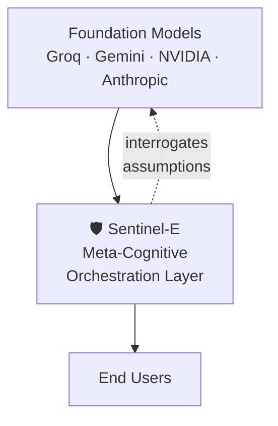
```mermaid
flowchart TB
    LLM["Foundation Models<br/>Groq · Gemini · NVIDIA · Anthropic"]
    SE["🛡️ Sentinel-E<br/>Meta-Cognitive<br/>Orchestration Layer"]
    USER["End Users"]

    LLM --> SE
    SE --> USER
    SE -.->|"interrogates<br/>assumptions"| LLM
```

Sentinel-E does not replace language models. It **structurally interrogates them**. When models agree, Sentinel-E evaluates whether the agreement is structurally stable under perturbation. When they disagree, it maps the fault lines and reports them transparently.

The system transforms multi-model reasoning into a **graph-analyzed, stress-tested, forensically logged epistemic system**.
