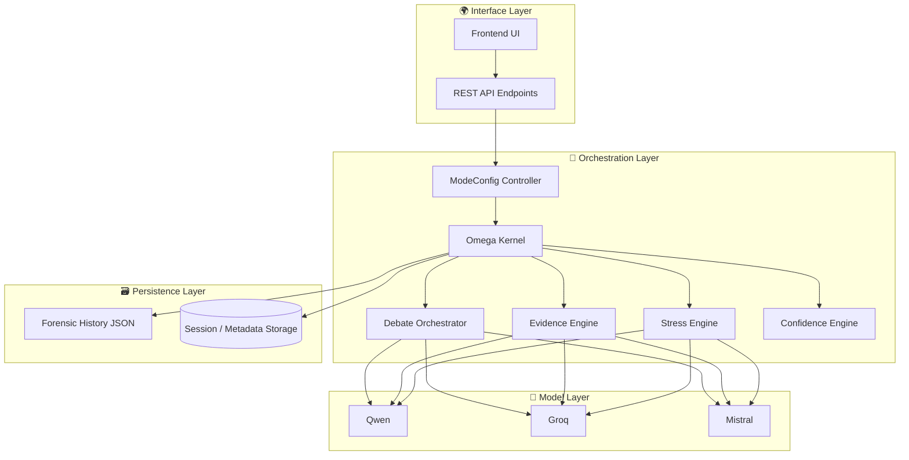
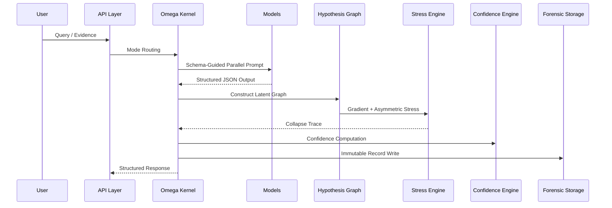
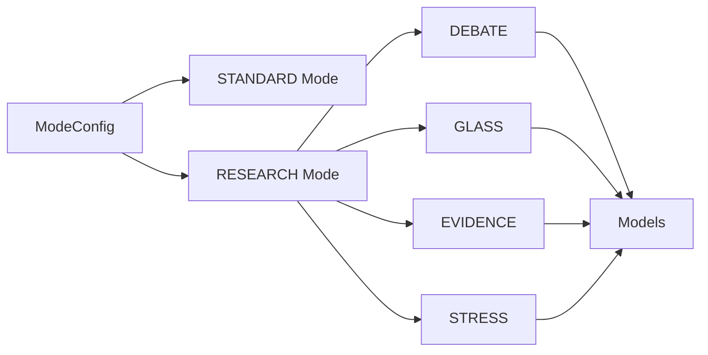
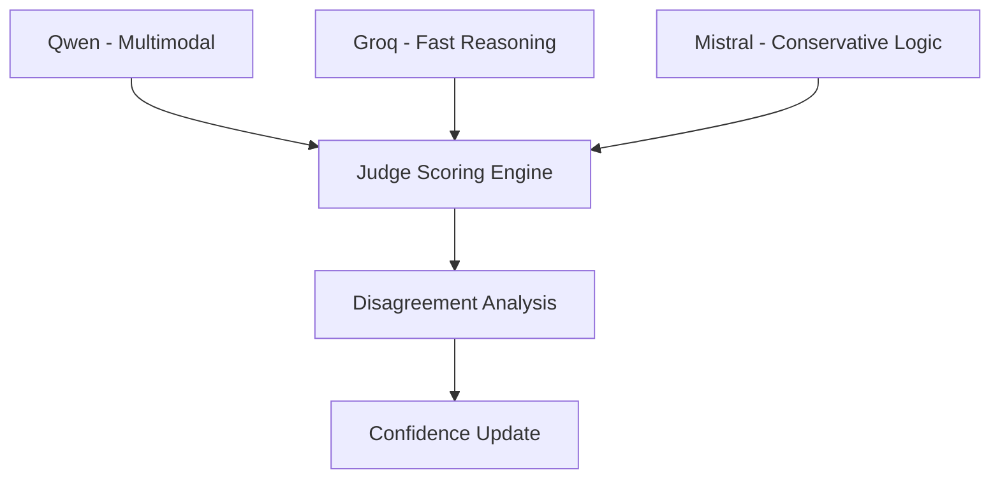
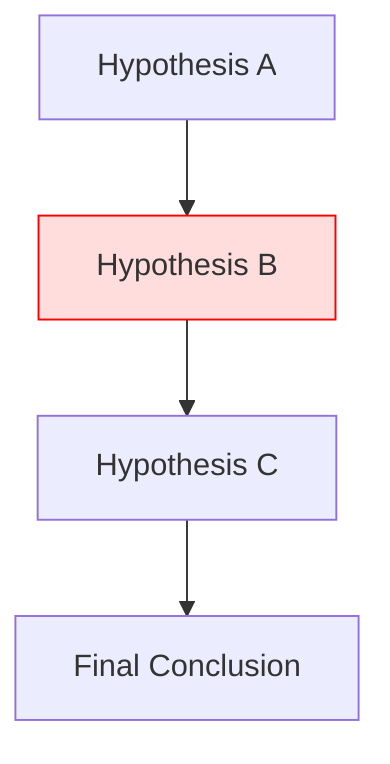
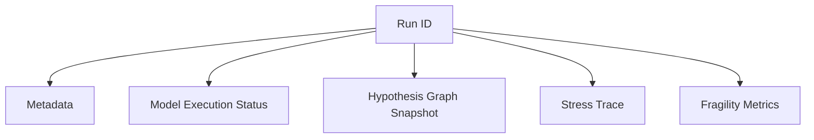
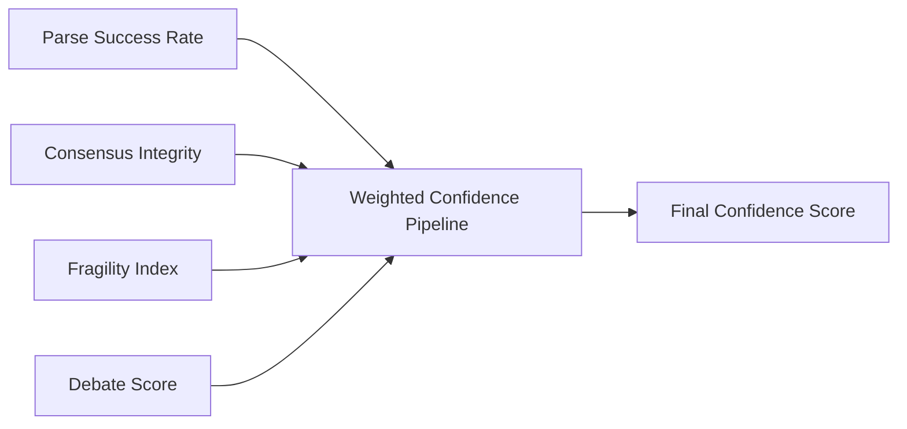
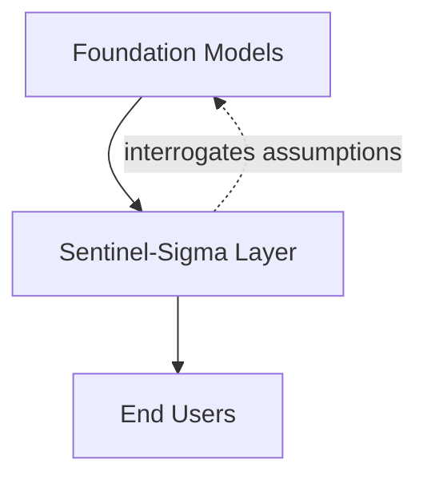

# 🛡️ Sentinel-E Cognitive Engine 3.X

> **Structural Epistemic Intelligence Layer for Multi-Model AI Systems**

---

# 🏗️ System Architecture (Visual Overview)

## 🌐 High-Level Layered Architecture

```mermaid
flowchart TB
    subgraph L1[🌍 Interface Layer]
        UI[Frontend UI]
        API[REST API Endpoints]
    end

    subgraph L2[🧠 Orchestration Layer]
        MK[ModeConfig Controller]
        OK[Omega Kernel]
        DE[Debate Orchestrator]
        EE[Evidence Engine]
        SE[Stress Engine]
        CE[Confidence Engine]
    end

    subgraph L3[🤖 Model Layer]
        Q[Qwen]
        G[Groq]
        M[Mistral]
    end

    subgraph L4[🗃️ Persistence Layer]
        FH[Forensic History JSON]
        DB[(Session / Metadata Storage)]
    end

    UI --> API
    API --> MK
    MK --> OK

    OK --> DE
    OK --> EE
    OK --> SE
    OK --> CE

    DE --> Q
    DE --> G
    DE --> M

    EE --> Q
    EE --> G
    EE --> M

    SE --> Q
    SE --> G
    SE --> M

    OK --> FH
    OK --> DB
```

---

# 🔁 Execution Flow (Deterministic Pipeline)

```mermaid
sequenceDiagram
    participant U as User
    participant API as API Layer
    participant OK as Omega Kernel
    participant M as Models
    participant HG as Hypothesis Graph
    participant ST as Stress Engine
    participant CF as Confidence Engine
    participant FS as Forensic Storage

    U->>API: Query / Evidence
    API->>OK: Mode Routing
    OK->>M: Schema-Guided Parallel Prompt
    M-->>OK: Structured JSON Output
    OK->>HG: Construct Latent Graph
    HG->>ST: Gradient + Asymmetric Stress
    ST-->>OK: Collapse Trace
    OK->>CF: Confidence Computation
    OK->>FS: Immutable Record Write
    OK-->>API: Structured Response
```

---

# 🧠 Mode System Architecture

```mermaid
flowchart LR
    MC[ModeConfig]

    MC --> STD[STANDARD Mode]
    MC --> RES[RESEARCH Mode]

    RES --> D[DEBATE]
    RES --> G[GLASS]
    RES --> E[EVIDENCE]
    RES --> S[STRESS]

    D --> Models
    G --> Models
    E --> Models
    S --> Models
```

---

# 🔬 Multi-Agent Debate Structure

```mermaid
flowchart TB
    Q[Qwen - Multimodal]
    G[Groq - Fast Reasoning]
    M[Mistral - Conservative Logic]

    Q --> J[Judge Scoring Engine]
    G --> J
    M --> J

    J --> DA[Disagreement Analysis]
    DA --> CF[Confidence Update]
```

---

# 🧩 Hypothesis Graph Model

```mermaid
flowchart TB
    H1[Hypothesis A]
    H2[Hypothesis B]
    H3[Hypothesis C]
    C[Final Conclusion]

    H1 --> H2
    H2 --> H3
    H3 --> C

    style H2 fill:#ffdddd,stroke:#ff0000
```

🔴 Highlighted nodes represent **single-point fragility risks**.

---

# 🔥 Stress Engine Architecture

```mermaid
flowchart LR
    E0[Full Evidence]
    E1[Ablation L1]
    E2[Ablation L2]
    E3[Ablation L3]

    E0 --> E1 --> E2 --> E3 --> Collapse[Hypothesis Collapse Order]
```

---

# 🗃️ Forensic Logging Structure

```mermaid
flowchart TB
    RUN[Run ID]
    META[Metadata]
    MODELS[Model Execution Status]
    GRAPH[Hypothesis Graph Snapshot]
    STRESS[Stress Trace]
    METRICS[Fragility Metrics]

    RUN --> META
    RUN --> MODELS
    RUN --> GRAPH
    RUN --> STRESS
    RUN --> METRICS
```

Each execution produces exactly one immutable JSON record.

---

# 📊 Confidence Computation Flow

```mermaid
flowchart LR
    ParseRate[Parse Success Rate]
    Integrity[Consensus Integrity]
    Fragility[Fragility Index]
    JudgeScore[Debate Score]

    ParseRate --> Weighted[Weighted Confidence Pipeline]
    Integrity --> Weighted
    Fragility --> Weighted
    JudgeScore --> Weighted

    Weighted --> FinalConfidence[Final Confidence Score]
```

---

# 🧠 Conceptual Positioning

```mermaid
flowchart TB
    Models[Foundation Models]
    Sentinel[Sentinel-Sigma Layer]
    Users[End Users]

    Models --> Sentinel
    Sentinel --> Users

    Sentinel -. interrogates assumptions .-> Models
```

Sentinel does not replace models.
It **structurally interrogates them**.

---

# ⚡ Core Principles

* Agreement ≠ Truth
* Confidence must be stress-tested
* Inconclusive is valid
* Failure must be recorded
* Structural robustness > majority voting

---

# 🏁 Final Architecture Statement

> When models agree, Sentinel-Sigma evaluates whether the agreement is structurally stable under perturbation.

Sentinel-E transforms multi-model reasoning into a **graph-analyzed, stress-tested, forensically logged epistemic system**.
