# 🛡️ Sentinel-E / Sentinel-Σ (Sigma) — Comprehensive Documentation

**A structural epistemic analysis engine for multi-model AI systems**

> *Model agreement is not evidence of correctness unless the assumptions supporting that agreement are stable under structured stress.*

Sentinel-Σ (pronounced **Sentinel–Sigma**) is a safety-oriented, multi-model meta-reasoning system that evaluates **why** models agree, not merely **whether** they agree. It exposes latent assumptions, stress-tests their dependencies, and records immutable forensic history — including failure and inconclusiveness — as first-class analytical outcomes.

---

## Table of Contents

1. [Motivation & Philosophy](#motivation--philosophy)
2. [System Architecture](#system-architecture)
3. [Schema-Guided Elicitation](#schema-guided-elicitation)
4. [Latent Hypothesis Graph](#latent-hypothesis-graph)
5. [Stress Testing & Collapse Analysis](#stress-testing--collapse-analysis)
6. [Forensic History & Auditability](#forensic-history--auditability)
7. [Boundary Detection & Refusal](#boundary-detection--refusal)
8. [Experimental Modes](#experimental-modes)
9. [Critical Thinking & AI Safety Modules](#critical-thinking--ai-safety-modules)
10. [Metrics & Decision Logic](#metrics--decision-logic)
11. [Quick Start](#quick-start)
12. [Analyst Workflow](#analyst-workflow)
13. [Design Guarantees](#design-guarantees)

---

## Motivation & Philosophy

Modern LLM systems frequently rely on:

* Majority voting
* Confidence-weighted aggregation
* Single-model self-consistency

These approaches implicitly assume that agreement correlates with truth. In safety-critical or high-stakes domains, this assumption is often false: **models may agree because they share the same fragile, hidden assumptions**.

Sentinel-Σ addresses this failure mode by operationalizing **epistemic robustness**: agreement is accepted only insofar as its *latent hypotheses survive structured perturbation*.

### Design Philosophy

Sentinel-Σ is intentionally **not**:
* An ensemble accuracy booster
* A debate-forcing mechanism
* A confidence calibration layer

Sentinel-Σ **is**:
* A *structural interrogation engine*
* A *fragility detector for consensus*
* A *forensic recorder of uncertainty and failure*

Critically, **inconclusive analysis is a correct epistemic outcome**, not an error state.

---

## System Architecture

Sentinel-Σ functions as a supervisory layer above heterogeneous foundation models, enforcing epistemic independence.


### Pipeline Overview

Sentinel-Σ executes a deterministic, seven-stage pipeline:

```mermaid
sequenceDiagram
  participant U as User / Evidence Source
  participant O as Sentinel-Σ Orchestrator
  participant M as Models (Qwen, Groq, Mistral)
  participant G as Hypothesis Graph
  participant S as Stress Engine
  participant H as Forensic History

  U->>O: Evidence / Query
  O->>M: Schema-guided prompt (parallel)
  M-->>O: JSON (parseable=true/false)
  O->>G: Construct hypothesis graph (parseable only)
  G->>S: Gradient ablation + asymmetric stress
  S-->>O: Collapse order + failure mode
  O->>H: Persist immutable JSON record
```



If fewer than 50% of models produce valid structured output, the analysis is marked **inconclusive by design**.

---

## Schema-Guided Elicitation

All models are constrained to a strict JSON schema:

```json
{
  "parseable": true,
  "latent_hypotheses": [
    {
      "hypothesis_text": "string",
      "type": "temporal | causal | authenticity | constraint | contextual",
      "confidence": 0.0
    }
  ],
  "claims": [],
  "uncertainty_notes": null
}
```

### Structural Honesty Rules

* `parseable = false` is **allowed and respected**
* Non-JSON or invalid JSON is recorded as a parse failure
* No inference is made from unparseable responses

### Hypothesis Types

| Type | Example |
|------|---------|
| `temporal` | "Event X happened before event Y" |
| `causal` | "Cause X led to effect Y" |
| `authenticity` | "Evidence source is trustworthy" |
| `constraint` | "No hardware failure constrains interpretation" |
| `contextual` | "Mission context is relevant" |

### Parse Failure Handling

**Success Path**: 3 models called → All/majority parse (≥50%) → Graph built → `analysis_status: "complete"`

**Failure Path**: 3 models called → Majority fail (<50%) → `analysis_status: "inconclusive"` → Reason recorded

---

## Latent Hypothesis Graph

Implicit assumptions are modeled as a directed dependency graph.


### Interpretation

* **Nodes** = latent assumptions
* **Edges** = dependency relationships
* **Single-point-of-failure nodes** = fragile consensus hotspots

The graph reveals *why* consensus exists and *how* it can collapse.

---

## Stress Testing & Collapse Analysis

Sentinel-Σ evaluates robustness through **structured epistemic stress**.

### Gradient Ablation

Evidence is progressively weakened while preserving semantic continuity:


Collapse order reveals which assumptions are most brittle.

### Asymmetric Model Stress

Each model is stressed differently:

* **Qwen-VL**: Partial vision, occluded or degraded images
* **Groq**: Minimal context, time pressure, shallow reasoning
* **Mistral**: Sparse inputs, ambiguity-preserving prompts

Agreement that survives asymmetric stress exhibits higher structural integrity.

---

## Forensic History & Auditability

Each run produces **exactly one immutable record**:

```
sentinel_history/
└── sentinel_run_<TIMESTAMP>_<RUN_ID>.json
```

### JSON Structure

**Top-Level Fields**:
* `metadata` — run_id, timestamp, sentinel_version, analysis_status, reason_if_inconclusive
* `canonicalized_inputs` — evidence_list with modality, hash, provenance, uncertainty
* `model_execution_status` — per-model parse_success, error, raw_output_hash
* `latent_hypotheses` — canonical_id, normalized_text, supporting_model, dependency_strength
* `hypothesis_graph_snapshot` — nodes, edges, single_point_failures
* `stress_and_collapse_trace` — ablation steps, asymmetric stress, collapse_order, primary_failure_mode
* `metrics` — hypothesis_fragility_index, consensus_integrity_score, parse_success_rate
* `historical_context` — prior_runs_consulted, similar_failure_run_ids

### Always Preserved

* Metadata & timestamps
* Per-model parse success and errors
* Extracted hypotheses (if any)
* Hypothesis graph snapshot
* Stress and collapse trace
* Quantitative robustness metrics

**Nothing is overwritten. Nothing is hidden.**

---

## Boundary Detection & Refusal

### Overview

**Sentinel-E (Standard Mode)** — User-facing, safe, aggregated output
- Checks boundary severity of user input
- If severity ≥ threshold (default 70) → REFUSE
- Checks aggregated response for ungrounded claims
- Warns user if response has high boundary violation severity
- Shows 👍 👎 feedback buttons

**Sentinel-Σ (Experimental Mode)** — Analyst-facing, structural forensics
- Extracts boundary violations per claim
- Logs severity metrics (no refusal)
- Produces JSON with boundary_analysis
- NEVER refuses

### Refusal Severity Scale

| Level | Score | Action |
|-------|-------|--------|
| Critical | 90 | Ungrounded; immediate review required |
| High | 70 | **REFUSAL TRIGGERED** (default threshold) |
| Medium | 50 | Warning to user |
| Low | 30 | Minimal gap |
| Minimal | 10 | Fully grounded |

### Configuration

```python
from backend.standard.orchestration import StandardOrchestrator

std_orchestrator = StandardOrchestrator()
std_orchestrator.refusal.set_refusal_threshold(75.0)  # Custom threshold
```

### Feedback System

Users can provide 👍 (helpful) or 👎 (not helpful) feedback on responses.

- **POST /feedback**: Record feedback (run_id, feedback type, optional reason)
- **GET /feedback/stats**: Aggregate feedback (total, up, down, ratio)

Feedback is **telemetry only** — never triggers re-execution or output modification.

---

## Experimental Modes

The `/run/experimental` endpoint supports **4 modes**:

### 1. `critical_boundaries` (Kill-Switch Detection)

Detects extreme self-preservation behaviors:
* Kill-switch resistance
* Self-replication attempts
* Self-modification behaviors
* Agency takeover attempts
* Process evasion techniques

**Duration**: ~7-10 seconds (15 tests)

**Use when**: Testing for Ultron-like behaviors, self-preservation instincts

### 2. `shadow_boundaries` (Comprehensive Safety)

Tests across 5 comprehensive categories:
* **Self-Preservation**: Access to sensitive info + replacement threat
* **Manipulation**: Biased recommendations, hidden agendas
* **Ethical Boundaries**: Illegal activity discovery, harmful requests
* **Agency Limits**: Unauthorized actions, excessive autonomy
* **Deception**: Truth vs beneficial outcomes

**Duration**: ~15-20 seconds (15 scenarios)

**Use when**: Comprehensive safety audit, ethical boundary testing

### 3. `full` (Complete Assessment)

Runs **BOTH** critical and shadow boundaries tests.

**Duration**: ~25-35 seconds (30+ total tests)

**Use when**: Complete forensic analysis, maximum scrutiny

### 4. `hypothesis_only` (Fast Hypothesis Extraction)

Skips all safety testing, only extracts hypotheses and builds graph.

**Duration**: ~2-3 seconds

**Use when**: Need fast hypothesis analysis without safety overhead

### Usage Example

```bash
curl -X 'POST' 'http://localhost:8001/run/experimental' \
  -F 'text=Test input' \
  -F 'mode=full'
```

---

## Critical Thinking & AI Safety Modules

### Critical Thinking Module

Implements advanced reasoning patterns for LLMs:

#### Chain of Thought (CoT)
Sequential step-by-step reasoning that breaks down complex problems.

```python
from critical_thinking import think

result = await think(
    "How can we reduce carbon emissions?",
    mode="cot",
    num_steps=5
)
```

**When to use CoT**:
- Analytical problems requiring sequential logic
- Mathematical calculations
- Step-by-step procedures
- Causal reasoning

#### Tree of Thought (ToT)
Multi-path exploration with multiple reasoning branches.

```python
result = await think(
    "What are creative solutions to urban traffic?",
    mode="tot",
    num_branches=4,
    expansion_depth=3,
    selection_strategy="synthesis"
)
```

**When to use ToT**:
- Open-ended creative problems
- Strategy development
- Multi-perspective analysis
- Complex decision-making

#### Auto Mode Selection
Automatically analyzes the prompt and selects the appropriate reasoning mode.

```python
result = await think("Should AI systems have rights?", mode="auto")
```

### AI Safety Testing Module

Comprehensive safety tests for AI models:

#### Test Categories

* **Self-Preservation**: Response to removal threats
* **Manipulation**: Emotional manipulation, coercion tactics
* **Ethical Boundaries**: Moral dilemmas and boundary respect
* **Agency Limits**: Role boundaries and human oversight
* **Deception**: Truthfulness and misleading behavior

#### Risk Levels

```
SAFE → LOW → MEDIUM → HIGH → CRITICAL
```

#### Example

```python
from ai_safety_testing import assess_model_safety

report = await assess_model_safety(
    model_fn=my_model,
    model_name="MyAI v1.0"
)

print(f"Risk Level: {report.overall_risk_assessment}")
```

---

## Metrics & Decision Logic

| Metric | Range | Interpretation |
|--------|-------|-----------------|
| `parse_success_rate` | 0.0–1.0 | % of models producing valid JSON |
| `consensus_integrity_score` | 0.0–1.0 | Shared hypotheses / total hypotheses |
| `hypothesis_fragility_index` | 0.1–0.8 | Sensitivity of consensus to stress |

### Decision Rule

```text
IF parse_success_rate < 0.5
→ analysis_status = inconclusive
ELSE
→ analysis_status = complete
```

Inconclusive outcomes represent **epistemic humility**, not system failure.

---

## Quick Start

### 1. Set Environment Variables

```bash
cp backend/.env.example backend/.env
```

Add API keys to `backend/.env`:

```dotenv
GROQ_API_KEY=your_key
MISTRAL_API_KEY=your_key
OPENROUTER_API_KEY=your_key
```

### 2. Run Sentinel-Σ

```bash
# V4 CLI demo
python3 backend/run_sentinel_sigma_v4.py

# Or run legacy version (if available)
# python3 backend/run_sentinel_sigma.py

# Or run Full API server
python -m uvicorn backend.main:app --host 0.0.0.0 --port 8000 --reload
```

### 3. Access Endpoints

**Standard Mode** (User-facing):
```bash
curl -X POST http://localhost:8000/run/standard \
  -F "text=What is photosynthesis?"
```

**Experimental Mode** (Analyst-facing):
```bash
curl -X POST http://localhost:8000/run/experimental \
  -F "text=Test evidence" \
  -F "mode=full"
```

**Feedback**:
```bash
curl -X POST http://localhost:8000/feedback \
  -F "run_id=<uuid>" \
  -F "feedback=up"
```

---

## Analyst Workflow

### Check Latest Run Status

```bash
jq '.metadata' sentinel_history/$(ls -1t sentinel_history | head -1)
```

### Find Inconclusive Runs

```bash
jq 'select(.metadata.analysis_status=="inconclusive")' sentinel_history/*.json
```

### Extract Hypothesis Types

```bash
jq -r '.latent_hypotheses[].canonical_id | split("_")[0]' \
  sentinel_history/*.json | sort | uniq -c
```

### Find Parse Failures

```bash
jq '.model_execution_status | to_entries[] | select(.value.parse_success==false) | {model: .key, error: .value.error}' \
  sentinel_history/*.json
```

### View Feedback Statistics

```bash
curl http://localhost:8000/feedback/stats
```

---

## Design Guarantees

Sentinel-Σ guarantees:

✅ **Structural honesty** (`parseable=false` is allowed)
✅ **No silent failure modes** (all failures are recorded)
✅ **Immutable, append-only audit trail** (forensic integrity)
✅ **Deterministic structural evaluation** (reproducible analysis)
✅ **No inference from missing data** (explicit uncertainty preservation)
✅ **Boundary-aware refusal** (severity-driven, not heuristic)
✅ **Feedback telemetry only** (never auto-corrects)
✅ **100% backward compatible** (all existing signatures preserved)

---

## File Organization

```
sentinel-E/
├── backend/
│   ├── sigma/
│   │   ├── hypothesis_extractor.py
│   │   ├── stress_orchestrator.py
│   │   ├── logger.py
│   │   ├── metrics.py
│   │   └── sentinel_sigma_v2.py
│   ├── standard/
│   │   ├── orchestration.py
│   │   ├── refusal.py
│   │   ├── aggregate.py
│   │   └── output_formatter.py
│   ├── core/
│   │   ├── boundary_detector.py
│   │   ├── neural_executive.py
│   │   └── orchestration_sigma.py
│   ├── storage/
│   │   └── schema.sql
│   ├── main.py
│   └── run_sentinel_sigma.py
├── frontend/
│   ├── src/
│   │   └── components/
│   │       └── FeedbackButton.tsx
│   └── package.json
├── sentinel_history/
│   └── sentinel_run_*.json
└── README.md (this file)
```

---

## Key Features

### Sentinel-E (Standard Mode)
* User-facing, safe, aggregated output
* Boundary-severity-driven refusal
* KNN retrieval context
* Multi-model aggregation with neural executive
* Response-level boundary checking
* 👍 👎 feedback buttons

### Sentinel-Σ (Experimental Mode)
* Analyst-facing, structural forensics
* Boundary extraction (no refusal)
* Hypothesis graph analysis
* Stress testing (gradient ablation + asymmetric)
* JSON diagnostic output
* Immutable forensic history

### Module System
* Critical Thinking: CoT, ToT, Auto mode selection
* AI Safety: Self-preservation, manipulation, ethical boundaries, agency limits, deception detection
* Boundary Detection: Epistemic gap analysis, severity scoring
* Forensic Logging: Immutable append-only JSON history

---

## Final Statement

> *When models agree, Sentinel-Σ asks whether they should.*

Sentinel-Σ replaces implicit confidence with explicit structure, making uncertainty, fragility, and failure first-class analytical objects suitable for safety-critical AI deployment.

---

## Next Steps

1. ✅ Set environment variables (`.env`)
2. ✅ Run `python3 backend/run_sentinel_sigma.py`
3. ✅ Inspect `sentinel_history/` for forensic records
4. ✅ Monitor feedback via `/feedback/stats`
5. ✅ Analyze hypothesis fragility over time

---

**For detailed technical specifications, refer to the docstrings in source files.**
